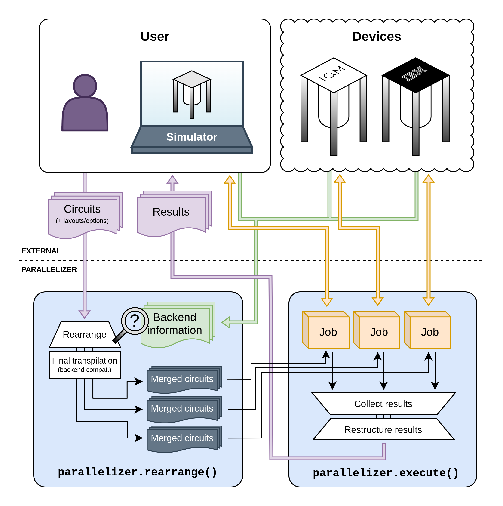

# Quantum Circuit Parallelizer

[](https://www.python.org)
[](https://pypi.org/project/qc-parallelizer)

A Python module for optimally combining and distributing quantum circuits. See the
[included notebooks](./notebooks/) for examples and documentation.

For an operational overview, see the diagram below.



## Why?

Motivation for this module comes from underutilization of increasingly large quantum processors in
quantum computing tasks that only require relatively few qubits at a time. The module merges several
independent circuits into a smaller set of wider circuits, which it then runs on available backends
in parallel. All of this happens behind the scenes, so ideally, the user can treat the module's
functionality as a parallelized drop-in replacement for Qiskit's `backend.run()`.

As an example, consider a task that involves running a four-qubit circuit several times with
different parameters. If each version of the circuit was naively submitted one by one to
[the 54-qubit VTT Q50](https://qx.vtt.fi/docs/devices/q50.html), 50 qubits would remain unused in
each job. This is very wasteful in terms of execution time, which then translates to unnecessary
operational costs.

Instead, depending on the connectivity of the four-qubit circuit, at least nine such circuits can be
packed into a single _host circuit_ that covers as many of Q50's qubits as it can. Optionally, the
parallelizer can also be instructed to leave "padding qubits" between packed circuits. This reduces
crosstalk between circuits at the cost of lower packing density.

## Installation

The package is on [PyPI](https://pypi.org/project/qc-parallelizer) and can be installed with `pip`:

```bash
pip install qc_parallelizer
```

## Usage example

Here is a brief and basic example:

```python
# Define or load a number of circuits.
from qiskit import QuantumCircuit
circuits = [QuantumCircuit(...), QuantumCircuit(...), ...]

# Define backends for circuit execution. These can be any Qiskit-compatible backend objects,
# but here we define two simulators that mimic IQM's 5-qubit Adonis architecture.
import iqm.qiskit_iqm as iqm
backends = [iqm.IQMFakeAdonis(), iqm.IQMFakeAdonis()]

# Parallelize and execute. This call will
#  1. determine how to combine the circuits and for which backends, and
#  2. submit jobs to the backends.
import qc_parallelizer as parallelizer
job = parallelizer.execute(circuits, backends=backends)

# Fetch and handle results. This plots the first circuit's result histogram, for example.
results = job.results()
qiskit.visualization.plot_histogram(result[0].get_counts())
# Information on the parallelization and underlying jobs is also available.
print(f"On average, {job.info.avg_circuits_per_backend} circuits were placed per backend.")
# The job object behaves just like a regular Qiskit Job object, but values are arrays.
print("Job IDs:")
for job_id in job.job_id():
    print(f" - {job_id}")
```

## Development setup

For the following commands, a virtual environment or equivalent isolation is recommended. This can
be done with Conda, for example, with
```bash
conda create --name parallelizer python=3.10 pip
conda activate parallelizer
```

The package can then be installed from a local copy of the directory by running

```bash
pip install -e .
```

from the repository root. If you additionally wish to run tests or the provided notebook(s), you
can install dependencies for those with

```bash
pip install .[tests]
# and/or
pip install .[notebooks]
```

## Testing

Running all tests is as simple as installing the required dependencies (see above) and running

```bash
pytest
```

from the repository root. Additionally, there is a benchmarking script in the `tests/` directory.

## Authors

- **Henri Ahola** &lt;firstname.lastname<area>@vtt.fi&gt;
