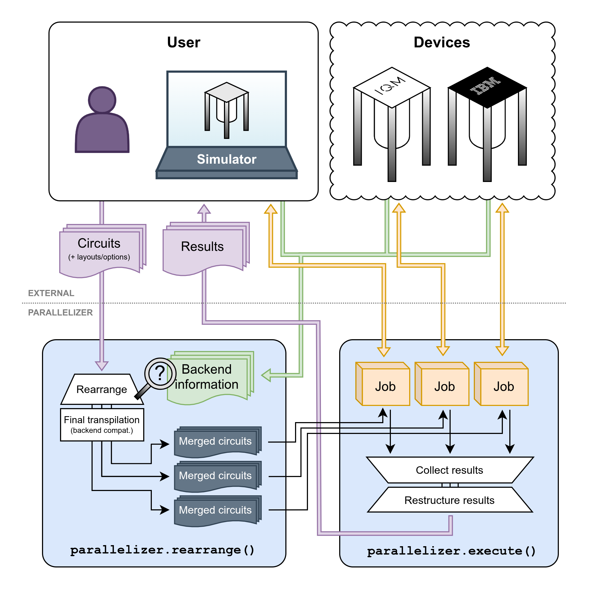

# Quantum Circuit Parallelizer

A Python module for optimally combining and distributing quantum circuits. See the
[included notebooks](./notebooks/) for examples and more information, but _very_ briefly, it works
as follows:

```python
# Define or load a number of circuits.
from qiskit import QuantumCircuit
parallel_circuits = [QuantumCircuit(...), QuantumCircuit(...), ...]

# Define backends for circuit execution. These can be any Qiskit-compatible backend objects.
import iqm.qiskit_iqm as iqm
backends = [iqm.IQMFakeAdonis(), iqm.IQMFakeAdonis()]

# Parallelize and execute.
import qc_parallelizer as parallelizer
job = parallelizer.execute(parallel_circuits, backends=backends)

# Fetch and handle results. This plots the first circuit's result histogram, for example.
results = job.results()
qiskit.visualization.plot_histogram(result[0].get_counts())
```

For an operational overview, see this diagram:



## Setup

For the following commands, a virtual environment or equivalent isolation is recommended.

The package can be installed from a local copy of the directory by running

```bash
pip install .
```

from the repository root. However, if you wish to run tests or the provided notebook(s), you must
install additional dependencies with

```bash
pip install .[tests]
# and/or
pip install .[notebooks]
```

## Testing

Running all tests is as simple as running

```bash
pytest
```

from the repository root. Additionally, there is a benchmarking script in the `tests/` directory.

## Authors

- **Henri Ahola** - henri.ahola@vtt.fi
